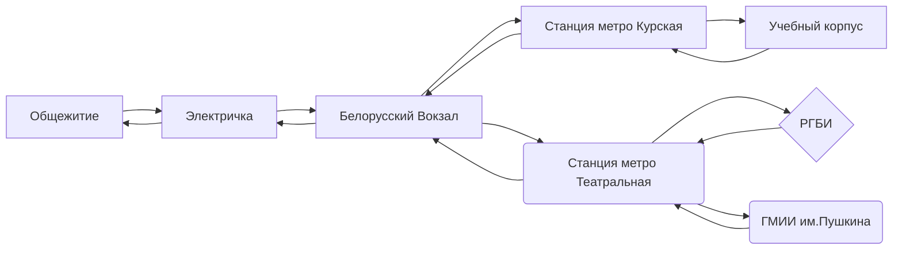

# Информация обо мне

## Я
Меня зовут **Макарова Валерия**, мне **18** лет и я искусствовед :clap:

## Где и когда
Я родилась в **республике Чувашия**, в городе **Новочебоксарск** *27 мая 1999 года* 

## Мои интересы

 - Музыка
 > Я слушаю много музыки абсолютно разных стилей. Не представляю свою дорогу до университета без наушников
 - Искусство
 > Это очевидный пункт, иначе я бы не училась там, где сейчас учусь
 - Литература
 > Раньше я читала гораздо больше. Теперь времени на книги совсем не хватает. Жду каникул, чтобы прочитать что-нибудь новое
 - Кинематограф
 > Люблю ужастики и фильмы Кристофера Нолана
 - Саморазвитие
 > Исходя из вышесказанного можно понять, что мне нравится развиваться и изучать что-то новое 

## Где учусь
Я учусь на первом курсе в лучшем вузе этой планеты **ВШЭ** на образовательной программе **История искусств**

## Мои регулярные маршруты

## Мое еженедельное расписание
|   | Понедельник                              | Вторник                         | Среда                                    | Четверг                                  | Пяница                  |
|---|------------------------------------------|---------------------------------|------------------------------------------|------------------------------------------|-------------------------|
| 1 |                                          |                                 |                                          |                                          |                         |
| 2 | Введение в историю человечества          |                                 | Введение в историю человечества          | Английский язык                          | Искусство Древнего мира |
| 3 | Искусство Древнего мира                  | Философия                       | Введение в историю человечества          |                                          | Искусство Древнего мира |
| 4 | Искусство Древнего мира                  | Философия                       | Английский язык                          | Профессиональные основы искусствоведения |                         |
| 5 | Профессиональные основы искусствоведения | Введение в историю человечества | Профессиональные основы искусствоведения | Профессиональные основы искусствоведения | Цифровая грамотность    |
| 6 |                                          | Введение в историю человечества | Профессиональные основы искусствоведения |                                          |                         |

## Ссылки на соцсети
[Я во Вконтакте](https://vk.com/valeriumi)
  
[Я в Telegram](http://telegram.me/valeriumia)
